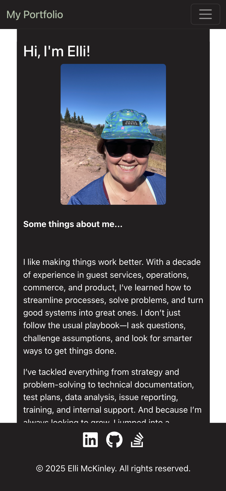

## Portfolio
This is my personal website designed to showcase my coding and developer skills. It features various projects and applications I have worked on, demonstrating my proficiency in JavaScript, React, and Bootstrap. Explore the site to see my work and learn more about my technical abilities.

[Website](https://ellimckinley.netlify.app/portfolio)

## Table of Contents
- [Usage Information](#usage-information)
- [License](#license)
- [Technologies Used](#technologies-used)
- [Contribution Guidelines](#contribution-guidelines)
- [Contact](#contact)

## License

This project is licensed under the [MIT](https://opensource.org/licenses/MIT) license.

## Technologies Used
- JavaScript
- React
- Bootstrap CDN

## Contribution Guidelines
Not accepting contributions at this time.

## Contact
For additional questions and instructions, please contact me at [elli.mckinley@gmail.com](mailto:elli.mckinley@gmail.com).

Checkout my other GitHub projects: [@ellimckinley](https://github.com/ellimckinley).

